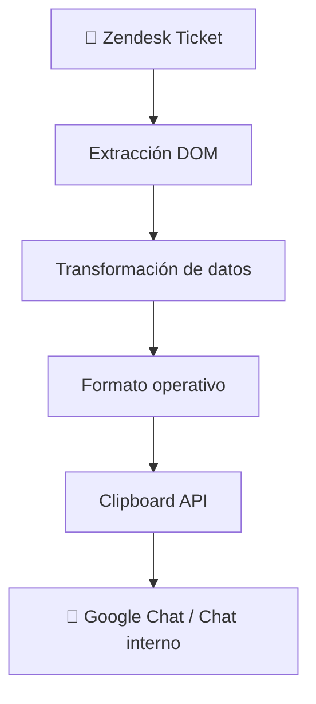

# Zendesk Ticket Reader

Extensión WebExtension compatible con Chrome y Firefox que extrae y muestra los datos clave de un ticket de Zendesk: asunto, prioridad y fecha de vencimiento, con opción de copiarlo al portapapeles en formato de texto listo para pegar en Google Chat o cualquier chat.

## Funcionalidades

- Muestra asunto, prioridad y fecha de vencimiento del ticket activo
- Traduce la prioridad al español (Urgente, Alta, Normal, Baja)
- Formatea la fecha de vencimiento en español
- Copia los datos al portapapeles con un placeholder `ASIGNADO: @` para mencionar manualmente al responsable
- Se actualiza automáticamente al navegar entre tickets

## Automatización

La extensión automatiza tareas repetitivas del flujo operacional en Zendesk:

- **Extracción automática de metadata del ticket** — lee asunto, prioridad y vencimiento sin intervención manual
- **Traducción de prioridades** — convierte los valores del sistema al español en tiempo real
- **Formateo de fechas** — transforma timestamps ISO a formato legible en español
- **Generación de texto listo para Google Chat** — arma el mensaje con estructura fija, lista para pegar
- **Copia inmediata al portapapeles** — un solo clic, sin seleccionar ni formatear nada

Reduciendo fricción manual y errores al compartir contexto entre equipos.

## Impacto operacional

**Antes de la extensión**, compartir el contexto de un ticket requería:

1. Abrir el ticket en Zendesk
2. Copiar el asunto manualmente
3. Buscar y leer la prioridad
4. Buscar y formatear la fecha de vencimiento
5. Armar el mensaje a mano
6. Pegarlo en Google Chat

**Con la extensión:**

1. Abrir el ticket
2. 1 clic → contexto listo para compartir

---

Cada handoff evitado es tiempo recuperado y contexto que no se pierde en el camino.


## Flujo automatizado



La extensión actúa como pipeline liviano entre la fuente de datos operacional y el canal de comunicación del equipo, sin intervención manual en ningún paso intermedio.

## Casos de uso

- **Escalamiento a ingeniería** — adjuntá el contexto del ticket en segundos al abrir un issue o thread
- **Comunicación soporte ↔ operaciones** — estandarizá el formato al pasar tickets entre equipos
- **Seguimiento de tickets críticos** — compartí prioridad y vencimiento sin abrir Zendesk
- **Compartir contexto rápidamente en Google Chat** — un clic y el mensaje está listo para pegar

## Stack

| Capa | Tecnología |
|------|-----------|
| Extracción | WebExtension Content Script (DOM API) |
| Comunicación | WebExtension Message Passing |
| UI | HTML + CSS vanilla |
| Integración | Clipboard API |
| Build | esbuild |
| Tests | Vitest + jsdom |

## Estructura del proyecto

```
src/
  app/
    popup/          # UI de la extensión (HTML, CSS, JS)
    content/        # Content script — listener de mensajes
  core/
    services/       # Lógica de extracción del ticket
  shared/
    constants/      # Selectores CSS y etiquetas de prioridad
    platform/       # Adaptadores del runtime WebExtension
    utils/          # Helpers de DOM y formateo
  assets/
    icons/
  manifest.json

tests/
  unit/             # Tests unitarios (format, dom, ticketService)

dist/               # Output del build (cargar esto en Chrome o Firefox)
```

## Tests

```bash
npm test                # corre los tests una vez
npm run test:watch      # modo watch para desarrollo
npm run test:coverage   # reporte de cobertura
```

Los tests viven en `tests/` a la misma altura que `src/`, separados del árbol de módulos que bundlea esbuild.

La cobertura excluye `src/app/` (`popup.js`, `content.js`) porque esos archivos dependen de APIs WebExtension que jsdom no puede simular. El resto (`src/core/`, `src/shared/`) tiene threshold de 80% en todas las métricas.

## Decisiones de diseño

- **Sin backend** — toda la lógica corre en el browser, sin latencia ni dependencias externas
- **Sin frameworks** — vanilla JS para mantener la extensión liviana y sin superficie de ataque
- **Content script sobre API** — evita exponer credenciales de Zendesk, lee directo del DOM
- **Coverage provider v8** — corre en el mismo runtime de Node sin instrumentación extra, más rápido que istanbul para código sin transpilación compleja

## Limitaciones

- Depende de la estructura del DOM de Zendesk Agent Workspace — cambios en el frontend de Zendesk pueden romper la extracción
- No compatible con Zendesk Classic
- Requiere que el ticket esté abierto en la pestaña activa

## Instalación en Chrome (modo desarrollador)

1. Clona este repositorio
2. Instala dependencias: `npm install`
3. Genera el build: `npm run build`
4. Abre Chrome y ve a `chrome://extensions`
5. Activa **Modo desarrollador** (esquina superior derecha)
6. Haz clic en **Cargar descomprimida** y selecciona la carpeta `dist/`

## Instalación en Firefox (temporal)

1. Clona este repositorio
2. Instala dependencias: `npm install`
3. Genera el build: `npm run build`
4. Abre Firefox y ve a `about:debugging#/runtime/this-firefox`
5. Haz clic en **Cargar complemento temporal**
6. Selecciona `dist/manifest.json`

Para publicar en Firefox Add-ons, comprime el contenido de `dist/` en un `.zip` después de ejecutar `npm run build`.

## Uso

1. Abre un ticket en Zendesk (`https://*.zendesk.com/agent/tickets/*`)
2. Haz clic en el ícono de la extensión
3. Los datos del ticket aparecen automáticamente
4. Usa **Copiar** para copiar el resumen al portapapeles

## Formato de copia

El texto generado utiliza [sintaxis markdown](https://support.google.com/chat/answer/7649118#use-markdown-formatting-desktop) compatible con Google Chat

    *TICKET* #12345: Nombre del asunto
    *ASIGNADO*: @
    *VENCIMIENTO*: 8 de mayo de 2026, 19:47:15
    *PRIORIDAD*: Normal

   > ASIGNADO: @ actúa como placeholder para completar manualmente la mención del responsable en Google Chat. 

## Compatibilidad

Probado en Zendesk Agent Workspace (versión moderna), Chrome y Firefox. No compatible con Zendesk Classic.
